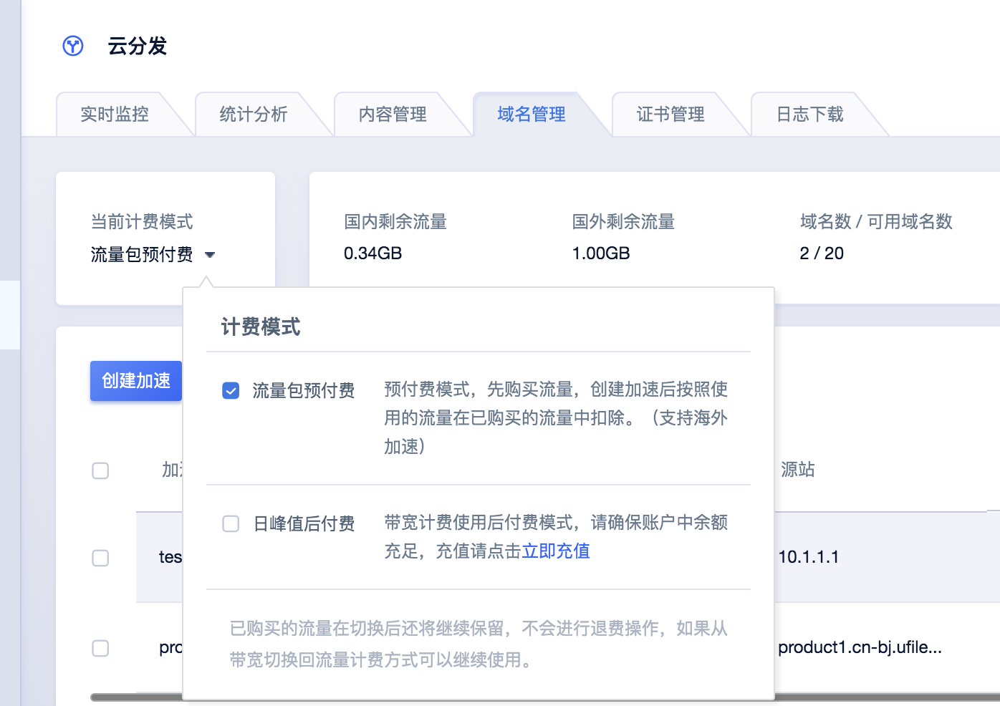

# 计费FAQ

## **账户欠费说明：**

1）当您未付清CDN服务产生的账单或账户内费用不足时，则服务处于欠费状态。

2）当您在  [预付费流量包]  计费模式下，使用流量超额并未新购流量包的情况下，每日会产生流量订单，如您账户余额连续三天不足以支付订单，CDN将停止加速。

3）如果存在欠费的情况，充值时将优先抵扣掉所欠费用；CDN加速停止后，您可在缴齐欠费后继续购买流量包，重新在控制台开启加速。

4）当您在［后付费日带宽峰值］计费模式下，如您账户余额连续三天不足以支付订 单，CDN将停止加速。

## **费用预警提示：**

＊提醒方式及联系人信息可在UMon监控的消息订阅功能中配置

1.当您在  [预付费流量包]  计费模式下，系统根据CDN服务最近10天已使用平均流量来判断用户预付费流量包余量是否足以其cdn服务继续使用3天，如果不足以将给予提醒，流量为0后不在提醒。

2.当您CDN使用量超出预购买的流量包，系统每日结算时会给予提醒。

3.当您账户余额不足以支付当天订单时，将给予提醒。

4.连续三天欠费，CDN将停止加速并将流量切回源，给予提醒。

## **变更计费方式：**

预付费流量计费和日峰值带宽计费，两种计费方式间可以互相切换。

切换计费方式将于次日0点生效，在此之前可以多次变更，以最后一次为准。

流量切换到带宽的计费模式时，已购买的流量在切换后还保留，不会进行退费操作。

带宽切换到流量的计费模式时，之前已购买过的流量将恢复。

### 操作步骤：

点击【当前计费模式】处的下拉按钮，可以勾选另一个计费方式进行切换。

## **计费流量与日志监控流量的区别：**

CDN加速服务在网络传输过程中，由于TCP/IP包头、TCP重传的情况，在原流量（日志合计流量）的基础上，还存在约10%-15%的网络消耗。我们取平均值10%做为网络消耗统计。

## **海外HTTPS收费说明：**

* 开通海外HTTPS需收取证书部署费用，具体价格请咨询客户经理

* 证书部署费用可以复用，当多个加速域名配置海外HTTPS时，均使用该证书，则不会重复计费。

* 如加速域名已不在使用请联系技术支持停止计费，以免产生额外费用，如域名为停止加速状态仍会继续收费。

## **账单归属项目说明：**

* 预付费订单根据发起项目落单，

* 后付费订单为用户粒度订单，会落单到默认项目下

*例如：客户的默认项目是项目A，用户在项目B里购买了预付费流量包，则该流量包落单在项目B当中;当流量包用完，变成后付费落单，后台会根据整个用户所使用量级计算费用，则生成的订单会落在默认项目A中。

* 若有其他相关CDN订单需求，可联系技术支持或客户经理。

## **境外统一预付费流量包与境外分区域流量包使用说明**

* 流量包抵扣方式：根据流量包到期时间抵扣。
  
* 代扣规则（流量包使用完之后）：剩余流量不足以抵扣使用流量，系统自动购买分区域流量包进行抵扣。

