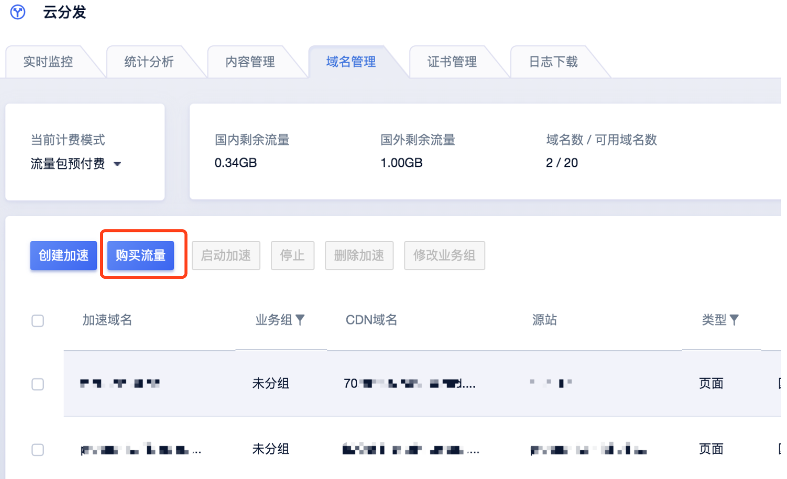
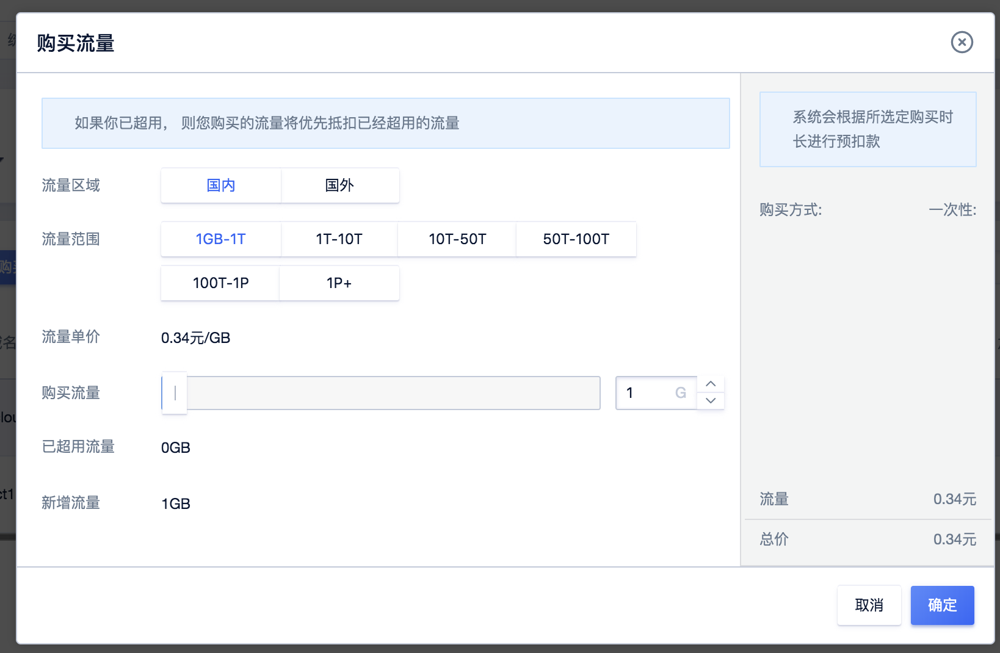

# 基础计费方式详述

## 预付费流量包

现在有国内加速和国外加速两种，分别使用阶梯价格，价格详情请参考
<https://www.ucloud.cn/site/product/jsq/>。

**计费规则：**

1）计费项：流量

2）付费方式：预付费

3）计费规则：按流量阶梯价格计费，使用流量直接从购买流量中扣除。

**使用范围：**

国内流量可以用于中国大陆全部加速类型。

国外流量可以用于港澳台及海外全部加速类型。

**价格：**

| 流量范围   | 国内流量  | 国外流量  |
| ---------- | --------- | --------- |
| 1GB~1TB    | 0.34元/GB | 0.45元/GB |
| 1TB~10TB   | 0.32元/GB | 0.40元/GB |
| 10TB~50TB  | 0.30元/GB | 0.36元/GB |
| 50TB~100TB | 0.28元/GB | 0.32元/GB |
| 100TB~1PB  | 0.25元/GB | 0.28元/GB |
| >1PB       | 0.20元/GB | 0.28元/GB |

ps：前闭后开，例如用户购买50TB的CDN,则对应消费为0.28＊50＊1024=14336元。

**流量超额：**

在［预付费流量包］计费模式下，当您的使用流量超出购买的流量包时将会产生欠费流量时：

* 此时新购流量包 > 欠费流量，即可抵扣，后续使用流量仍直接从购买流量中扣除
* 若未新购流量包或新购流量包 <= 欠费流量，将自动转变为按天流量后付费，系统会每日结算，累计当日流量并对比价格梯度产生订单。

**操作步骤：**

1）在【域名管理页面】点击【购买流量】进行流量包够买

2）选择区域，指定购买流量包大小，购买即可。

## 后付费日带宽峰值

现在有国内加速和国外加速两种，分别使用阶梯价格，价格详情请参考
<https://www.ucloud.cn/site/product/jsq/>。

**计费规则：**

1.计费项: 带宽

2.付费方式：后付费，使用前需要确保账户余额不为0。

3.计费周期：按日计费，每日中午12:00后结算前一天的带宽，匹配对应梯度价格，生成订单。

4.计算方法：按宽峰值带宽计费是以您CDN服务产生的带宽最高值（单位Mbps）为结算标准；按峰值带宽计费示例：
客户当日的峰值带宽为540Mbps（小于500Mbps单价为1.1元，大于500Mbps小于5G单价为0.90元），则用户的账户扣费金额应为
500＊1.1元+40＊0.90元=586元。

**价格**

| 数据中心  | 带宽区间      | 单价（元/Mbps/天） | 单价（元/Mbps/月） | 计算公式（天）                                               | 计算公式（月）                 |
| --------- | ------------- | ------------------ | ------------------ | ------------------------------------------------------------ | ------------------------------ |
| 国内/国外 | 0-500Mbps     | 1.1                | 33                 | 1.1\*x                                                       | 33 \* x                        |
|           | 500Mbps-5Gbps | 0.9                | 27                 | (x - 500) \* 0.9 + 500 \* 1.1                                | (x - 500) \* 27 + 16500        |
|           | \> 5Gbps      | 0.8                | 24                 | (x - 5 \* 1000) \* 0.8 + (5 \* 1000 - 500) \* 0.9 + 500 \* 1.1 | (x - 5 \* 1000) \* 24 + 141240 |

ps：前开后闭，例如0-500Mbps包含500Mbps

阶梯计费：x为当月实际带宽值，0-500部分执行1.1的价格，500Mbps-5Gbps执行0.9的价格，大于5Gbps执行0.8的单价

按宽峰值带宽计费是以您CDN服务产生的带宽最高值（单位Mbps）为结算标准；按峰值带宽计费示例：
客户当日的峰值带宽为540Mbps（小于500Mbps单价为1.1元，大于500Mbps小于5G单价为0.90元），则用户的账户扣费金额应为
500＊1.1元+40＊0.90元=586元。

