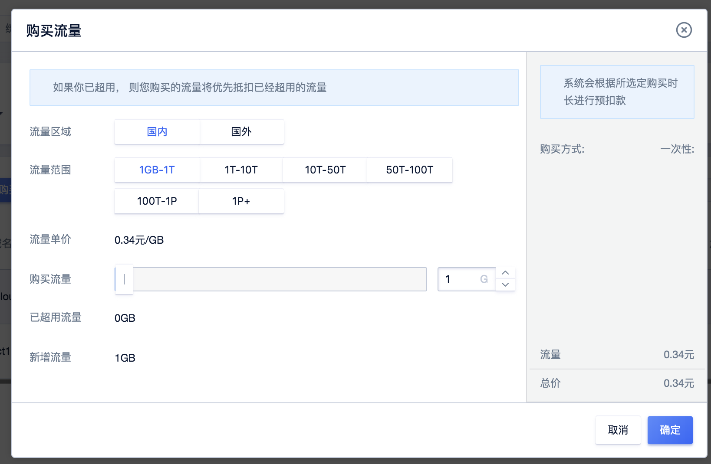

# 基础计费方式详述

自2021年11月1日0时起，新使用的CDN客户默认用新价格方案进行计费，此前的使用CDN（使用过CDN）的客户使用旧价格进行计费。

本次价格调整只针对线上计费用户，计费类型为：预付费流量包和日峰值带宽后付费 ，不涉及线下月付客户。

更多详情请联系客户经理

## 预付费流量包(新)

现在有国内加速和国外加速两种，分别使用阶梯价格，价格详情请参考
<https://www.ucloud.cn/site/product/jsq/>。

[旧价格查看](/ucdn/charge)

**计费规则：**

1）计费项：流量

2）付费方式：预付费

3）计费规则：按流量阶梯价格计费，使用流量直接从购买流量中扣除。

**使用范围：**

国内流量可以用于中国大陆全部加速类型。

国外流量可以用于港澳台及海外全部加速类型。

**价格：**

| 流量范围        | 国内流量     | 国外流量     |
| ----------- | -------- | -------- |
| 1GB~1TB    | 0.20元/GB | 0.45元/GB |
| 1TB(含)~10TB   | 0.20元/GB | 0.40元/GB |
| 10TB(含)~50TB  | 0.18元/GB | 0.36元/GB |
| 50TB(含)~100TB | 0.15元/GB | 0.32元/GB |
| 100TB(含)~1PB  | 0.15元/GB | 0.28元/GB |
| ≥1PB       | 0.11元/GB | 0.28元/GB |

ps：前闭后开，例如用户购买50TB的CDN,则对应消费为0.15＊50＊1024=7680元

**流量超额：**

在［预付费流量包］计费模式下，当您的使用流量超出购买的流量包时将会产生欠费流量时：

* 此时新购流量包 > 欠费流量，即可抵扣，后续使用流量仍直接从购买流量中扣除
* 若未新购流量包或新购流量包 <= 欠费流量，将自动转变为按天流量后付费，系统会每日结算，累计当日流量并对比价格梯度产生订单。

**操作步骤：**

1）在【域名管理页面】点击【购买流量】进行流量包够买

2）选择区域，指定购买流量包大小，购买即可。

## 后付费日带宽峰值（新）

现在有国内加速和国外加速两种，分别使用阶梯价格，价格详情请参考
<https://www.ucloud.cn/site/product/jsq/>。

**计费规则：**

1.计费项: 带宽

2.付费方式：后付费，使用前需要确保账户余额不为0。

3.计费周期：按日计费，每日中午12:00后结算前一天的带宽，匹配对应梯度价格，生成订单。

4.计算方法：按宽峰值带宽计费是以您CDN服务产生的带宽最高值（单位Mbps）为结算标准；按峰值带宽计费示例：
客户当日的峰值带宽为540Mbps，则用户的账户扣费金额应为
500＊0.52元+(540-500)＊0.50元=280元。

**价格**

| 带宽区间          | 单价（元/Mbps/天） | 单价（元/Mbps/天） |
| ------------- | ------------ | ------------ |
|               |    国  内    |  港澳台+海外 |
| 0-100Mbps(含) | 0.53          | 1.1          |
|100Mbps-500Mbps(含)| 0.52      | 1.1          |
| 500Mbps-5Gbps(含) | 0.50         | 0.9          |
| 5Gbps-50Gbps（含）| 0.49          | 0.8          |
|   ≥50Gbps    |0.48            |  0.8         |

阶梯计费：x为当日实际带宽值，0-100Mbps部分执行0.53的价格，500Mbps-5Gbps执行0.50的价格，大于50Gbps执行0.48的单价。

按宽峰值带宽计费是以您CDN服务产生的带宽最高值（单位Mbps）为结算标准。

