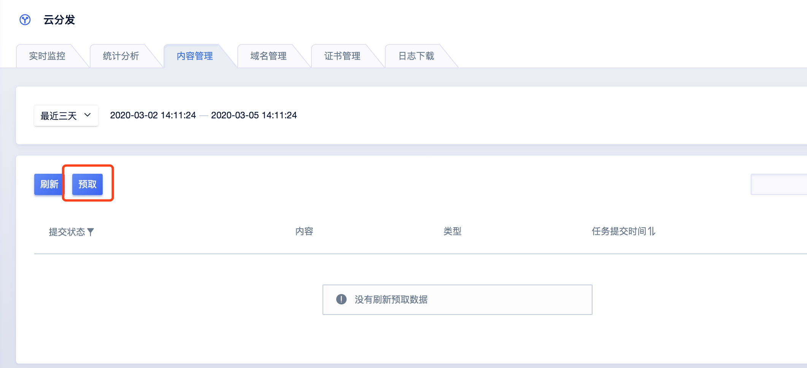
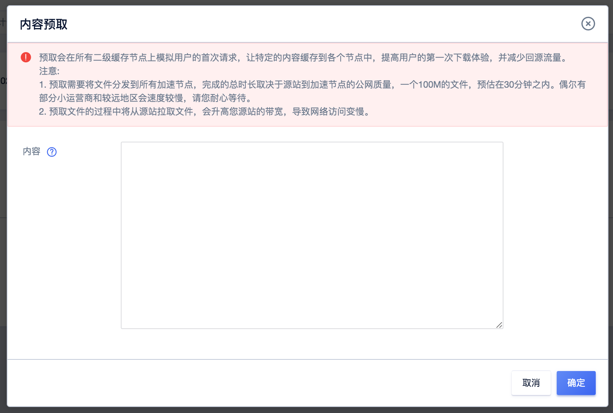

# 内容预取

内容预取是指在提交预热文件后，会将源站文件缓存到CDN上层节点上，当用户首次请求时，CDN节点会响应用户请求，无需再回源站获取。

一般在业务高峰前预热热点资源，减钱源站压力，提高请求的命中效率。

内容预取支持文件预取，不支持目前预取。

注：

- 填写文件的完整路径，必须以http(s)://开头，eg：http(s)://static.ucloud.cn/packages/document.zip。
- 每条url一行，以回车换行。一次性最多提交30条。
- 文件大的时候，预取有可能占用大量带宽，建议在不影响业务的时候进行预取。
- 如果发现预取一直显示处理中，有可能是由于路径填写不正确。填写文件的完整路径，必须以http(s)://开头，如http(s)://static.ucloud.cn/packages/document.zip。

>加速类型为下载时，预取文件与页面加速略微不同。
>
>下载类型的加速，预取文件是主动从源站获取文件至二级服务器进行加速，需要注意：预取文件不能是图片、html、文本等能够在网页加速中进行加速的文件格式。

#### 操作步骤：

