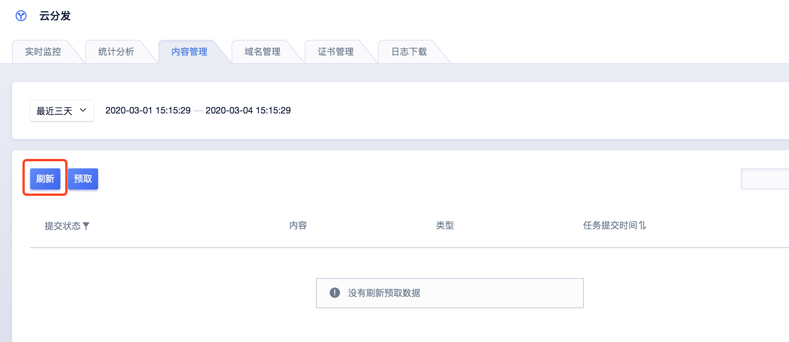
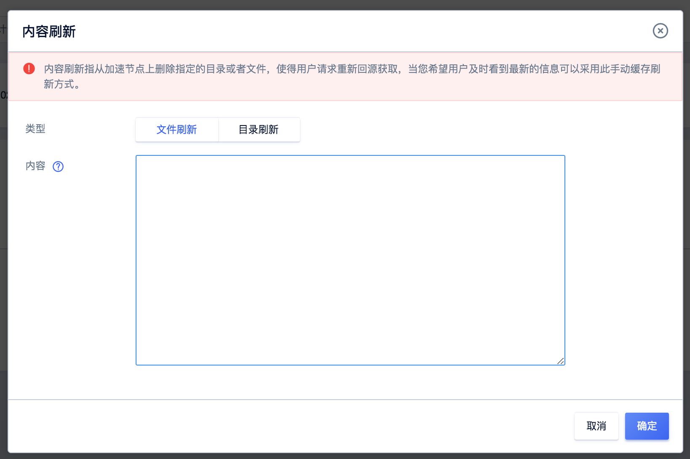

# 内容刷新

内容刷新是指提交URL刷新或目录刷新请求后，CDN节点的缓存内容将会被清除，再次向CDN节点请求资源时，CDN节点会直接回源获取最新文件，并将其缓存。

一般当您源站有文件更新时，您可以通过内容刷新，来保证用户获取到最新文件。

内容刷新包括：文件刷新和目录刷新

**要刷新的目录**

1） 必须以http(s)://开头，以/结尾。

2） 请注意区分url中的字母的大小写，错误的大小写会导致刷新无效。

3） 如果目录有上下级层次关系，本功能会自动同时推送下级子目录，不需要填写下级子目录。

**要刷新的文件**

1） 必须以http(s)://开头，填写完整的路径，如 http://static.ucloud.cn/images/test.jpg

2） 请注意区分url中的字母的大小写，错误的大小写会导致刷新无效

3） 一次最多提交30条url，一行一条

注意：

* 目录和文件如果同时填写，会同时提交目录和文件中填写的内容。内容刷新的记录和状态可在性能中进行查看。
* 大文件下载和点播的内容刷新不允许输入中文，中文经过转码也不支持。 而网页加速的内容刷新允许输入中文，但是如果中文经过转码则会失败。

#### 操作步骤：

