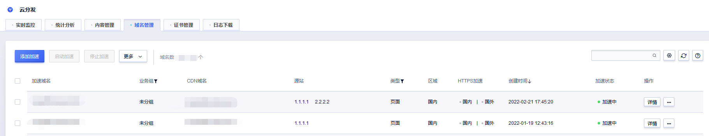

# 域名基本信息和操作

通过本文，您可以了解到加速域名的基本信息和一些基本操作

#### 基本信息：

域名管理页面展示域名相关的基本信息。包括加速域名、源站、CDN域名等。

#### 基本操作：

添加加速：填写基本信息，创建加速域名。

购买流量：当您账户为预付费流量包计费方式时，需要购买流量后才能创建加速域名，其他计费方式不支持购买流量包。

修改业务组：修改域名归属的业务组，便于域名的管理和分类。

停止加速：当您某一域名暂时不想使用CDN加速时，可通过停止加速操作，暂停CDN加速，此时用户请求将会请求至您的源站。

删除加速：当您某一域名已不需要在使用CDN加速时，可通过删除域名操作来停止CDN服务。

启动加速：当您某一域名状态在“停止加速”时，可通过启动加速来恢复CDN加速。

