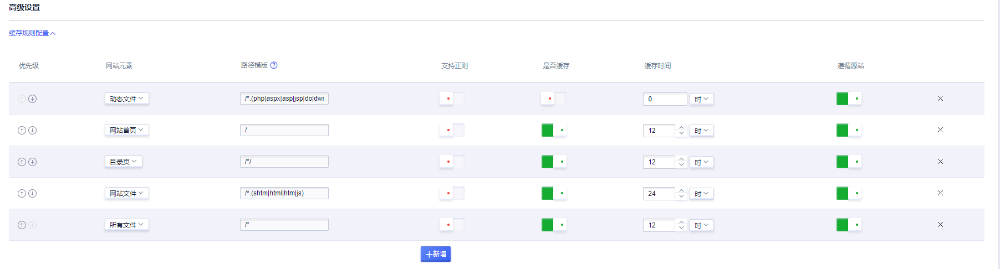
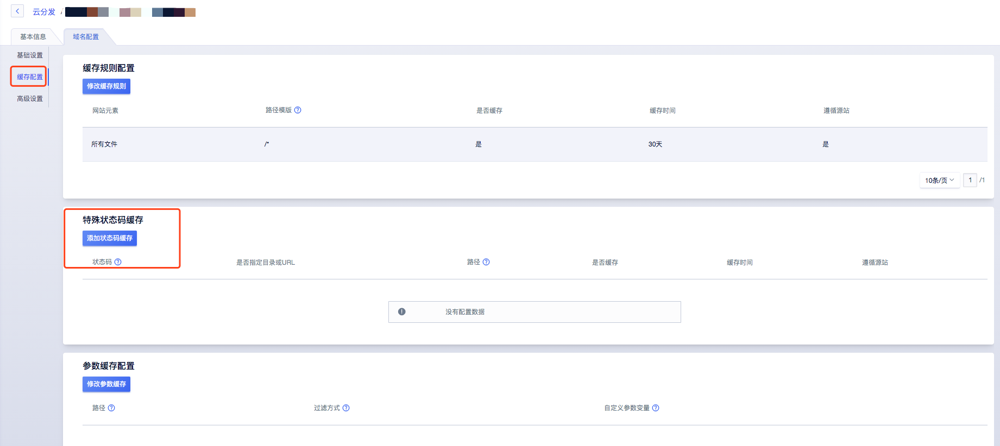
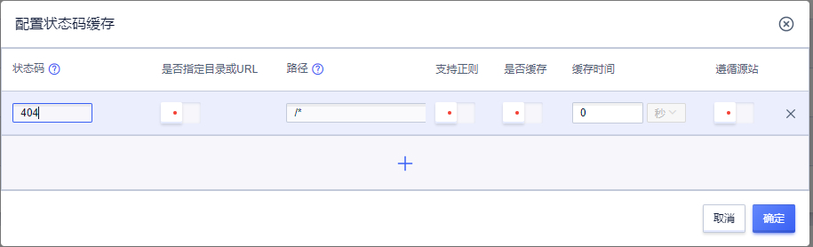

# 缓存配置

在CDN加速过程中，缓存规则的配置非常重要，配置适当的缓存规则，可以达到事半功倍的效果，通过本文您可以了解如何配置及相关的注意事项等。

## 一、缓存规则配置

### 操作步骤

1.可在创建域名时，会提供默认的缓存规则，可以根据实际需求进行修改，设置合适的缓存规则；

2.可进入域名配置详情页面，选择<code>域名配置</code>→<code>基础设置</code>→<code>缓存配置</code>→修改缓存规则，进行对应域名的缓存相关配置

创建域名：



默认缓存规则：
```
若加速类型为：页面
默认缓存规则为：
1、缓存规则优先遵循源站配置，若源站无缓存规则，则按照默认遵循以下缓存规则
2、动态文件：(php|aspx|asp|jsp|do|dwr|cgi|fcgi|action|ashx|axd|json) 不缓存
3、其他所有文件，缓存30天。
4、若源站返回响应头部信息：no-cache 、no-store ，则不缓存。

若加速类型为：下载/点播
默认缓存规则为：
1、所有文件缓存30天，遵循源站缓存。

若加速类型为：全站加速
默认规则为：
1、所有文件不缓存，遵循源站缓存
```

参数缓存配置

在域名配置的缓存配置中可以配置保留或忽略参数缓存策略。若需自定义参数生效，需联系技术支持非标配置。

默认参数缓存规则：
```
  若加速类型为：页面
  默认带参数缓存
 
  若加速类型为：下载/点播
  默认去参数缓存
```


域名配置：

点击配置缓存规则，可根据业务需求，针对不同网站元素进行匹配配置，包括去参缓存配置。


当在域名配置处，配置修改完成后一定要点击<code>**确认配置**</code>后，才能成功修改配置。


### 缓存配置项说明

| 配置项       | 说明                                                         |
| ------------ | ------------------------------------------------------------ |
| 优先级       | <li>缓存规则优先级，策略：自上而下。<br/>  <li>通过调整缓存规则顺序，设置缓存规则优先级。 |
| 网站元素     | <li>网站元素即要设置缓存的文件类型，包含网页文件、图片文件、文本文件等等。<br /> <li>可通过新增，自定义网站元素名称。 |
| 路径模板     | <li>选定网站元素后，会匹配对应的路径模板。详细说明见下方<br /> <li>可通过新增，自定义路径模板，必须以/为开头。<br /> <li>可以是文件类型，eg: /.html、 可以是目录文件 eg: /news/、可以是详细路径文件 eg: /news/image.jpg |
| 缓存时间     | <li>资源对应的缓存时间，建议您参照以下规则进行配置<br /> <li>对于不经常更新的静态文件（如图片类型、应用下载类型等），建议您将缓存时间设置为1个月以上<br /> <li>对于频繁更新的静态文件（如js、css等），您可以根据实际业务情况设置<br /><li>对于动态文件（如php、jsp、asp等），建议您将缓存时间设置为0s，即不缓存。 |
| 是否缓存     | <li>是否按照设置策略缓存该条规则。<br /><li>默认情况下，php、aspx、asp、jsp、do、dwr、cgi、fcgi、action、ashx、axd、json等动态文件不缓存，且优先级最高。 |
| 是否遵循源站 | <li>默认为遵循源站，遵循源站的情况下，如果源站有设置过期时间，将以源站的过期时间为准。若源站没有过期设置，将按照设置的缓存规则为准。</li> |

### 路径模板说明：

```
1.斜杠 /是代表网站首页，/xx/ 代表 /xx/ 子目录的首页

2.斜杠开头的 /news/ * 是代表news目录下所有文件

3./(news|xiao)/ * 是代表 news 和 xiao目录下的所有文件

4.斜杠开头的 / * 是代表全部文件

5.斜杠开头的 / *.jpg 是代表全部jpg文件，也包含/xx/等子目录下的所有jpg文件

6.斜杠开头的 / .(html) 是代表根目录下html类型的所有文件，/.(html|js) 是代表根目录下 html 和 js类型的所有文件

7.斜杠开头的 /news/image.jpg 是代表 news 目录下的具体的 image.jpg 文件，news(image.jpg|logo.jpg)代表 news 目录下的image.jpg 和 logo.jpg 文件
```
  
## 二、特殊状态码缓存

### 操作步骤

在域名配置的缓存配置中可以配指定目录或文件的状态码过期时间。

1、进入域名配置详情页面，选择<code>域名配置</code>→<code>基础设置</code>→<code>缓存配置</code>→特殊状态码缓存，进行配置



2、添加状态码缓存



添加配置项说明：

| 配置项            | 说明                                                         |
| ----------------- | ------------------------------------------------------------ |
| 状态码            | <li>状态码为特殊状态码缓存，2xx状态码缓存以配置的缓存策略进行缓存，200或206，不可配置该缓存策略<br /><li>状态码默认缓存时间为0S。 |
| 是否指定目录或URL | <li>识别指定目录或URL的响应状态码缓存，默认为所有文件。         |
| 路径              | <li>具体路径，默认为/* 代表所有文件<br /><li>路径可以是文件类型，eg:<code> /.html</code>，可以是目录文件 eg:<code> /news/</code>，可以是详细路径文件 eg: <code>/news/image.jpg</code> | 
| 是否缓存          | <li>是否需要配置缓存，是，则需要配置对应的缓存时间        | 
| 缓存时间          | <li>状态码缓存时间，单位秒                            |
| 遵循源站          | <li>若您选择遵循源站，则以源站的缓存规则为准。       |

