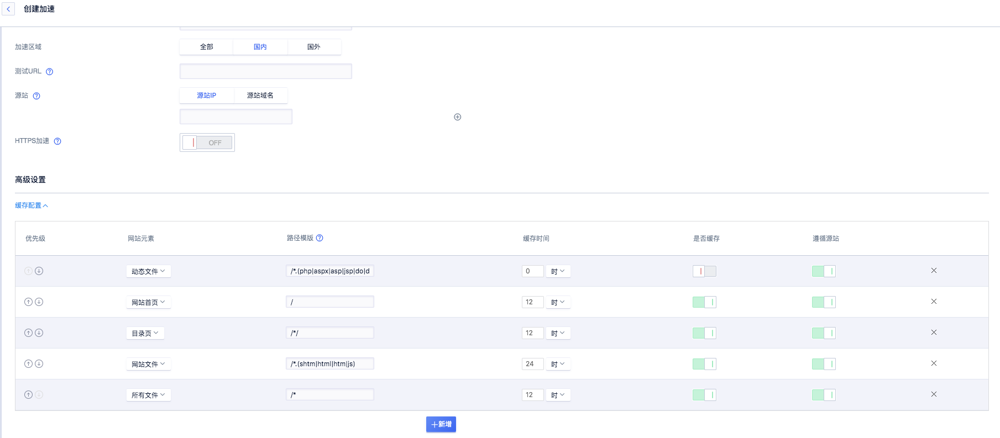
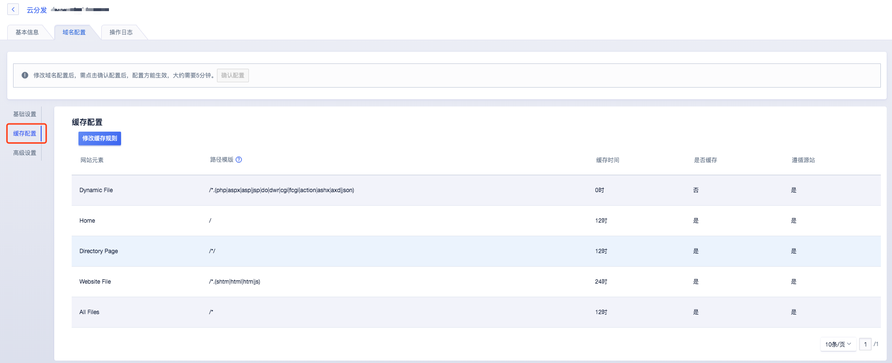
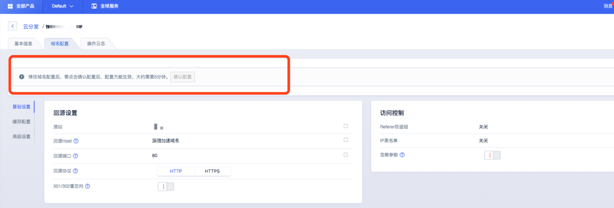

# 缓存配置

在CDN加速过程中，缓存规则的配置非常重要，配置适当的缓存规则，可以达到事半功倍的效果，通过本文您可以了解如何配置及相关的注意事项等。

#### 操作步骤

1.可在创建域名时，设置合适的缓存规则；

2.可进入域名配置详情页面，选择【域名配置】—【基础设置】—【缓存配置】—修改缓存规则，进行对应域名的缓存相关配置

创建域名：

域名配置：

> 当在域名配置处，配置修改完成后一定要点击**确认配置**后，才能成功修改配置。
>
>

#### 缓存配置项说明

| 配置项       | 说明                                                         |
| ------------ | ------------------------------------------------------------ |
| 优先级       | *  缓存规则优先级，策略：自上而下。 *  通过调整缓存规则顺序，设置缓存规则优先级。 |
| 网站元素     | *  网站元素即要设置缓存的文件类型，包含网页文件、图片文件、文件文件等等。 *  可通过新增，自定义网站元素名称。 |
| 路径模板     | *  选定网站元素后，会匹配对应的路径模板。详细说明见下方 *  可通过新增，自定义路径模板，必须以/为开头。 *  可以是文件类型，eg: /.html、 可以是目录文件 eg: /news/、可以是详细路径文件 eg: /news/image.jpg |
| 缓存时间     | *  资源对应的缓存时间，建议您参照以下规则进行配置 *  对于不经常更新的静态文件（如图片类型、应用下载类型等），建议您将缓存时间设置为1个月以上 *  对于频繁更新的静态文件（如js、css等），您可以根据实际业务情况设置 *  对于动态文件（如php、jsp、asp等），建议您将缓存时间设置为0s，即不缓存。 |
| 是否缓存     | *  是否按照设置策略缓存该条规则。 *  默认情况下，php、aspx、asp、jsp、do、dwr、cgi、fcgi、action、ashx、axd、json等动态文件不缓存，且优先级最高。 |
| 是否遵循源站 | *  默认为遵循源站，遵循源站的情况下，如果源站有设置过期时间，将以源站的过期时间为准。若源站没有过期设置，将按照设置的缓存规则为准。 |

##### 路径模板说明：

1.斜杠 /是代表网站首页，/xx/ 代表 /xx/ 子目录的首页

2.斜杠开头的 /news/ * 是代表news目录下所有文件

3./(news|xiao)/ * 是代表 news 和 xiao目录下的所有文件

4.斜杠开头的 / * 是代表全部文件

5.斜杠开头的 / *.jpg 是代表全部jpg文件，也包含/xx/等子目录下的所有jpg文件

6.斜杠开头的 / .(html) 是代表根目录下html类型的所有文件，/.(html|js) 是代表根目录下 html 和 js类型的所有文件

7.斜杠开头的 /news/image.jpg 是代表 news 目录下的具体的 image.jpg 文件，news(image.jpg|logo.jpg)代表 news 目录下的image.jpg 和 logo.jpg 文件

