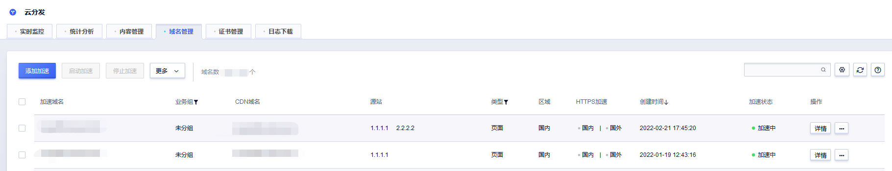
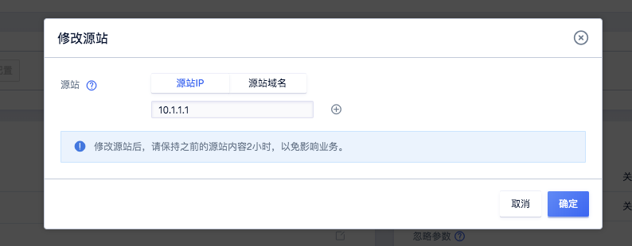
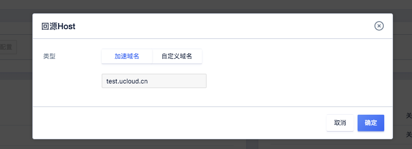
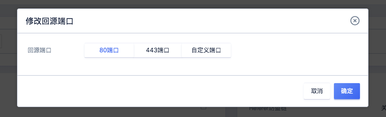

# 回源配置

当您需要修改回源相关配置时，通过本文您可以了解如何配置及相关的注意事项等。

## 源站配置

UCloudCDN支持的源站类型包括源站域名、UFile域名、IP。

*  当源站为多个IP时，将采用<strong>轮询</strong>的方式回源。
*  如有其他需求控制台无法满足，请联系技术支持进行配置。

## 回源端口配置

回源请求时指定请求至哪个端口。

| 端口           | 说明                                                 |
| -------------- | ---------------------------------------------------- |
| 80端口/443端口 | 回源请求将以HTTP或HTTPS协议回源到80端口或者443端口。 |
| 自定义端口     | 自定义回源端口，可以通过配置指定协议对应的回源端口； 只有回源协议是HTTP的时候，才指出自定义端口；回源协议是HTTPS，回源端口只能是443   |

## 回源HOST配置

回源HOST指CDN节点在回源过程中，指定具体访问源站的哪一个站点。

| 回源HOST   | 说明                                                         |
| ---------- | ------------------------------------------------------------ |
| 加速域名   | <strong>默认</strong>回源HOST为<strong>加速域名</strong>。                                     |
| 源站域名   | 当源站为<strong>UFile</strong>时，需指定回源HOST为<strong>源站域名</strong>，否则回源会失败。  |
| 自定义域名 | 自定义回源HOST，当源站为多个域名或站点时，需要自定义域名，指定具体回源HOST |

## 回源协议配置

回源请求时指定HTTP或者HTTPS协议回源。

| 回源协议  | 说明                                                 |
| --------- | ---------------------------------------------------- |
| HTTP协议  | 回源请求时，通过HTTP协议回源，默认为HTTP协议         |
| HTTPS协议 | 回源请求时，通过HTTPS协议回源，源站需要支持443端口。 |

## 301/302重定向

当回源请求返回301/302状态码时，节点会直接请求指定地址获取资源。

#### 操作步骤：

1.进入UCDN产品控制台<strong>域名管理</strong>页面，选择需要配置的域名。

2.进入域名配置详情页面，选择<strong>域名配置</strong>→<strong>基础设置</strong>→<strong>回源设置</strong>，进行回源相关配置。

3.修改源站、修改回源HOST、回源端口、回源协议等。

>配置修改完成后一定要点击<strong>**确认配置**</strong>后，才能成功修改配置。
>
>

## 配置源站为US3域名

1.需要在US3创建存储空间,空间类型为，<strong>公开空间</strong>

2.点击<strong>域名管理</strong>,进入bucket域名管理页面，点击<strong>绑定自定义域名</strong>;自定义域名填写为需要在CDN加速的域名，并选择CDN加速为<strong>是</strong>

3.点击<strong>确定</strong>之后会跳转到CDN配置页面，此时系统已自动填写加速域名和源站信息，在确认其他配置完成之后，可以点击确定，完成CDN域名新增.

注意：域名配置中回源HOST需配置为：<strong>跟随加速域名</strong>（默认），否则US3不会将CDN回源流量识别为CDN回源流出流量而进行收费（会识别为外网流出流量进行费用结算）。

4.确定之后，新增域名成功，页面跳转到CDN域名管理列表，待审核下发完成之后，进行域名CNAME切换即可完成CDN加速。

5.对应的US3自定义域名也会相应的添加对应的记录

6.如果已有存储空间，在CDN配置业务域名时，源站是US3的域名，US3就会自动在自定义域名生成对应的业务域名。
