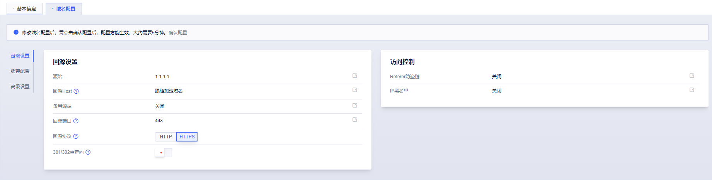

# 回源配置

当您需要修改回源相关配置时，通过本文您可以了解如何配置及相关的注意事项等。

#### 源站配置

UCloudCDN支持的源站类型包括源站域名、UFile域名、IP。

*  当源站为多个IP时，将采用<strong>轮询</strong>的方式回源。
*  如有其他需求控制台无法满足，请联系技术支持进行配置。

#### 回源端口配置

回源请求时指定请求至哪个端口。

| 端口           | 说明                                                 |
| -------------- | ---------------------------------------------------- |
| 80端口/443端口 | 回源请求将以HTTP或HTTPS协议回源到80端口或者443端口。 |
| 自定义端口     | 自定义回源端口，可以通过配置指定协议对应的回源端口； 只有回源协议是HTTP的时候，才指出自定义端口；回源协议是HTTPS，回源端口只能是443   |

#### 回源HOST配置

回源HOST指CDN节点在回源过程中，指定具体访问源站的哪一个站点。

| 回源HOST   | 说明                                                         |
| ---------- | ------------------------------------------------------------ |
| 加速域名   | <strong>默认</strong>回源HOST为<strong>加速域名</strong>。                                     |
| 源站域名   | 当源站为<strong>UFile</strong>时，需指定回源HOST为<strong>源站域名</strong>，否则回源会失败。  |
| 自定义域名 | 自定义回源HOST，当源站为多个域名或站点时，需要自定义域名，指定具体回源HOST |

#### 回源协议配置

回源请求时指定HTTP或者HTTPS协议回源。

| 回源协议  | 说明                                                 |
| --------- | ---------------------------------------------------- |
| HTTP协议  | 回源请求时，通过HTTP协议回源，默认为HTTP协议         |
| HTTPS协议 | 回源请求时，通过HTTPS协议回源，源站需要支持443端口。 |

#### 301/302重定向

当回源请求返回301/302状态码时，节点会直接请求指定地址获取资源。

#### 操作步骤：

1.进入UCDN产品控制台<code>域名管理</code>页面，选择需要配置的域名。

2.进入域名配置详情页面，选择<code>域名配置</code>→<code>基础设置</code>→<code>回源设置</code>，进行回源相关配置。

3.修改源站、修改回源HOST、回源端口、回源协议等。

>配置修改完成后一定要点击<code>**确认配置**</code>后，才能成功修改配置。
>
>

