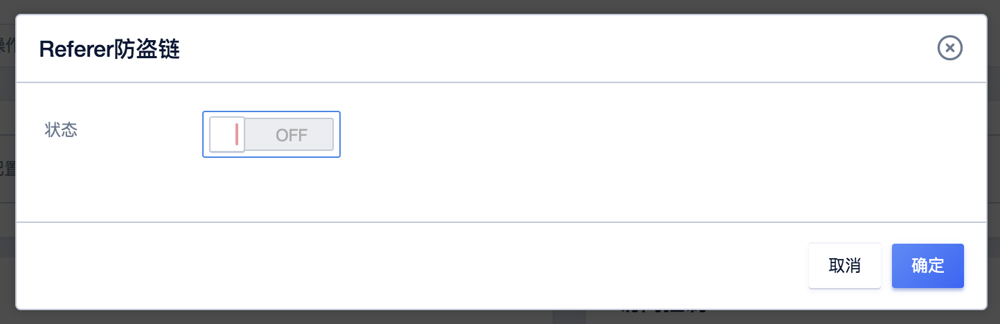
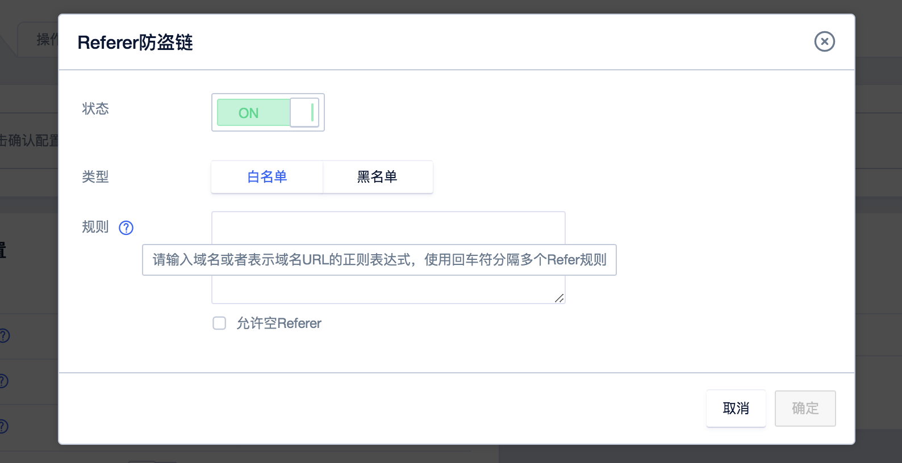
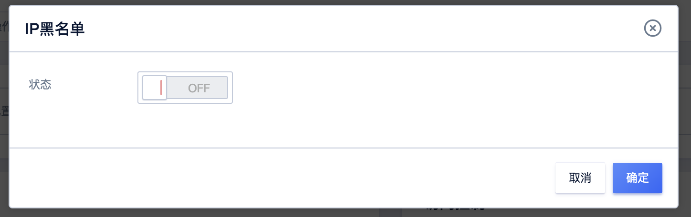
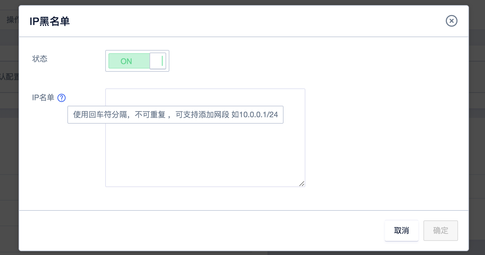
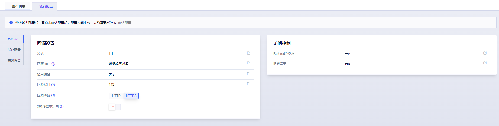
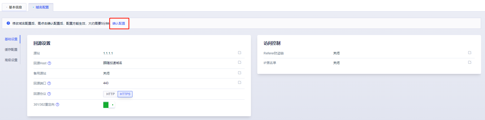

# 访问控制

当您需要限制访问CDN资源时，您可以通过本文您可以了解如何配置及相关的注意事项等。

## Referer防盗链

您可以通过配置Referer防盗链黑名单和白名单来识别和控制用户请求，提升加速域名的安全性，避免恶意用户盗链。

*  Referer防盗链是根据 HTTP Request Header 中 <strong>referer </strong>字段的值来识别和判断，根据用户设置的策略，进行访问用户过滤。
*  目前Referer防盗链分为黑名单和白名单两种机制，默认情况下不启用。
*  可设置是否允许空Referer字段访问资源，即允许通过浏览器地址栏直接访问资源URL。

Referer防盗链






## IP黑名单

您可以通过配置IP黑名单来识别和控制用户请求，提升加速域名的安全性，避免恶意用户访问。

* IP黑名单，黑名单内的IP将无法访问资源，默认情况下黑名单为空。
* 支持添加IP网段，例如10.0.0.1/24 ；注意：封禁网段只支持/24位以上，列如封禁网段为10.0.0.0/8或者10.0.0.0/20 均不生效。

IP黑名单






## MD5防盗链

您可以通过配置MD5防盗链，来保护用户站点的资源不被非法用户下站盗用，而避免因为盗链导致的带宽飙升和成本的大幅增长。

MD5防盗链暂时无法通过控制台进行配置，配置需提供秘钥和过期时间，请联系架构师或者技术支持进行配置。

配置说明：

```

k = substr(md5(密钥 + 文件URI + 过期时间 t),8,16)

1、k：URL 中参数名，substr(md5(串值),8,16)， md5 生成的串是 32 位，取出中间的 16 位作为参数 k 的值

2、t：过期时间，如当前是 2012-04-23 16:20:00 设置有效时长 2 小时，即失效时间为2012-04-23 18:20:00 换算成基于 1970 年的秒数为 1335176400，即参数 t 的值。

3：密钥：用户提供秘钥字符串。

举例： URL：http://tysxtest.ufile.ucloud.com.cn/test/3e2_teacher_720p.mp4

密钥： whaty321；

过期时间：2小时。如2019-07-01 12:00过期，转换后t=1561953600；

k=substr(md5(whaty321/test/3e2_teacher_720p.mp41561953600))=substr(1100bda530528404109eaa80bd9fb9d8,8,16)=30528404109eaa80

添加防盗链后的URL：http://tysxtest.ufile.ucloud.com.cn/test/3e2_teacher_720p.mp4?k=30528404109eaa80&t=1561953600

```

使用防盗链的URL能够进行正常访问，如果k对应不上则访问失效，如果校验发现t的时间已经超过有效时长，校验也会失败。

#### 操作步骤：

1.进入UCDN产品控制台<code>域名管理</code>页面，选择需要配置的域名。


2.进入域名配置详情页面，选择<code>域名配置</code>→<code>基础设置</code>→<code>访问控制</code>，进行相关配置。



3.开启Referer防盗链、IP黑名单等配置。

>配置修改完成后一定要点击<code>**确认配置**</code>后，才能成功修改配置。
>
>


