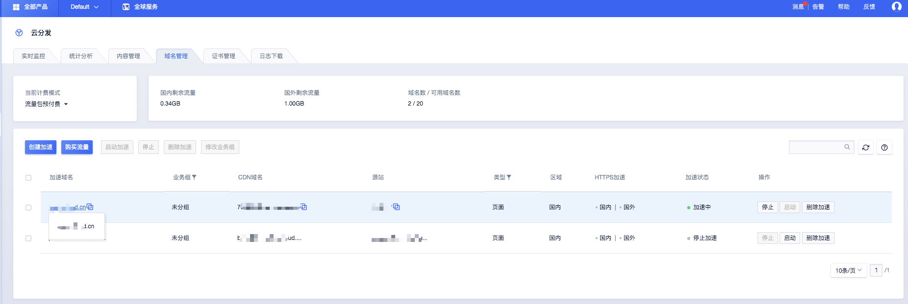

# 访问控制

当您需要限制访问CDN资源时，您可以通过本文您可以了解如何配置及相关的注意事项等。

#### Referer防盗链

您可以通过配置Referer防盗链黑名单和白名单来识别和控制用户请求，提升加速域名的安全性，避免恶意用户盗链。

*  Referer防盗链是根据 HTTP Request Header 中 referer 字段的值来识别和判断的，根据用户设置的策略，进行访问用户过滤。
*  目前Referer防盗链分为黑名单和白名单两种机制，默认情况下不启用。
*  可设置是否允许空Referer字段访问资源，即允许通过浏览器地址栏直接访问资源URL。

#### IP黑名单

您可以通过配置IP黑名单来识别和控制用户请求，提升加速域名的安全性，避免恶意用户盗链。

* IP黑名单，黑名单内的IP将无法访问资源，默认情况下黑名单为空。
* 支持添加IP网段，例如10.0.0.1/24。

#### 忽略参数

您可以通过忽略

#### 操作步骤：

1.进入UCDN产品控制台【域名管理】页面，选择需要配置的域名。

2.进入域名配置详情页面，选择【域名配置】—【基础设置】—访问控制，进行相关配置。

3.开启Referer防盗链、IP黑名单、忽略参数等。

>配置修改完成后一定要点击**确认配置**后，才能成功修改配置。
>
>

Referer防盗链

IP黑名单

忽略参数

