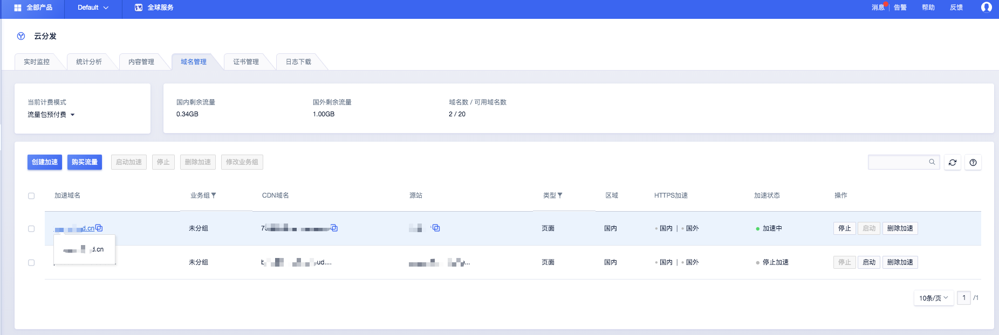
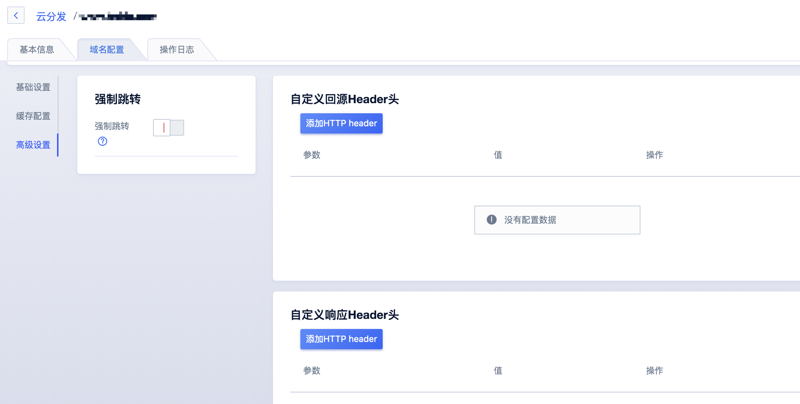
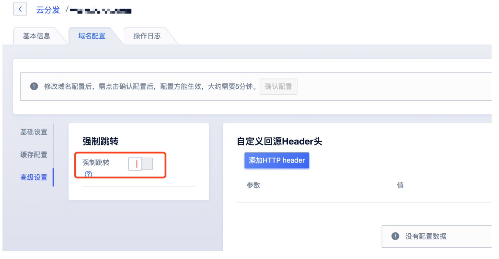
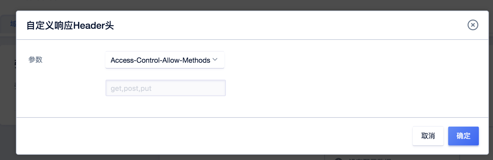
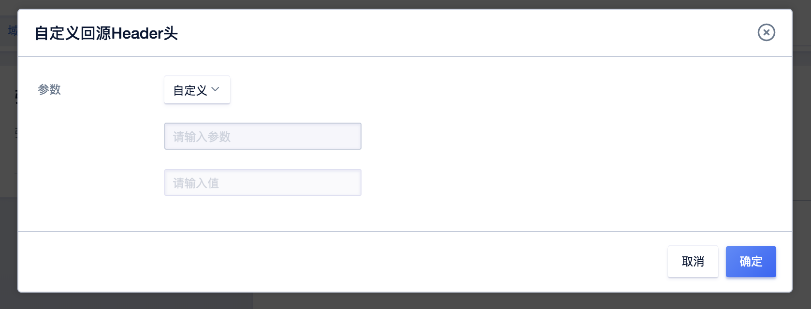

# 高级设置

关于CDN的更多配置，您可以通过本文您可以了解如何配置及相关的注意事项等。

#### 强制跳转

您可以通过设置强制跳转，将用户的请求强制重定向为HTTPS

> 执行该操作前，请您确保对应域名已成功配置HTTPS证书。
>

#### 自定义回源Header头

通过配置回源HTTPHeader头，您可以设定回源头部信息。通过设置参数和对应值的方式来实现HTTPHeader头的设置。

| 参数       | 说明                                       |
| ---------- | ------------------------------------------ |
| 自定义参数 | 根据您的业务实际需求，进行参数和值的设定。 |

#### 自定义响应Header头

通过配置响应HTTPHeader头，您可以实现跨域访问、设定或指定头部信息包含在HTTP响应头中。通过设置参数和对应值的方式来实现HTTPHeader头的设置。

常见的HTTP响应头参数如下说明：

| 参数                          | 说明                                                         |
| ----------------------------- | ------------------------------------------------------------ |
| Access-Control-Allow-Origin   | 指定允许的跨域请求的来源。 当设置为“*”，允许被所有域请求。 |
| Access-Control-Allow-Methods  | 指定允许的跨域请求方法。 一般的方法有POST, GET, OPTIONS等。 |
| Access-Control-Max-Age        | 指定客户端程序对特定资源的预取请求返回结果的缓存时间。       |
| Access-Control-Expose-Headers | 指定允许的跨域请求的字段。 像Cache-Control、Content-Language、Content-Type等 |
| 自定义参数                    | 您也可以自定义参数。                                         |

#### 操作步骤

1.进入UCDN产品控制台【域名管理】页面，选择需要配置的域名。

2.进入域名配置详情页面，选择【域名配置】—【基础设置】—【高级设置】，进行相关配置。

3.开启强制跳转、添加回源header头，添加响应header头。

>配置修改完成后一定要点击**确认配置**后，才能成功修改配置。
>
>

开启强制跳转

添加响应Header头

添加回源Header头

