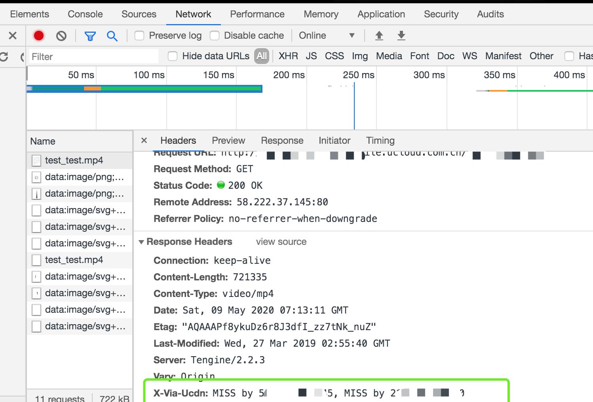
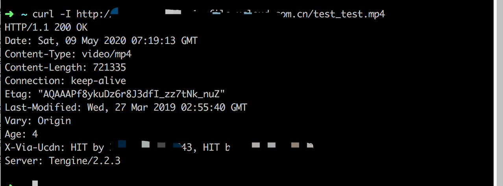
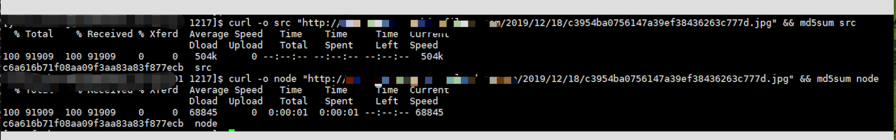

# FAQ

#### Q：接入CDN加速的域名有什么要求？

A：在接入 CDN 加速时，加速国内区域，需要在工信部完成备案，且源站的业务内容必须合法，否则将无法接入您的域名。加速海外区域源站的业务内容必须合法。

#### Q：CDN 配置大概需要多久？

A：CDN 配置时间一般不超过30分钟，若您设置后等待时间超过30分钟，您可及时联系技术支持协助您处理。

#### Q：页面加速、下载加速、点播加速有什么区别，该如何选择？

A：**区别**：面向的加速内容不同，页面加速主要针对网页文件、图片文件等小文件；下载加速主要针对安装包，压缩包等大文件；点播加速主要针对MP4等视频文件。

​      **选择**：一般文件大于5M，建议接入大文件平台，若为视频类文件，选择点播加速。

#### Q：CDN预取时产生的流量会计费吗？

A：接入CDN加速后，预取时产生的流量将不计入收费。

#### Q：<http://www.xxx.com/abc.jpg> 和 <http://www.xxx.com/abc.jpg?t=xxx> 是否判定为2个不同的文件？

A：是否为不同的文件根据您的配置来，若配置忽略参数缓存，两个问题将会视为同一个文件。若没有配置忽略参数缓存，将会判断为两个不同的文件。

​      默认下载加速和点播加速是忽略参数缓存，页面加速不忽略参数缓存。

#### Q：是否支持动态加速。

A：暂不支持动态加速，动态内容直接回源，不能缓存。

#### Q: 如何判断用户访问内容在CDN节点上是否命中？

A：可以通过浏览器的开发者工具或“curl - I +文件URL ” 进行查看。如果缓存，那么就是显示hit，当为hit时，即为CDN节点缓存了用户请求的内容。如果为miss，则CDN节点并为缓存改内容，此时将会回源获取数据响应用户，同时会根据域名配置的缓存策略，将内容缓存到CDN节点上。

#### Q：网站内容更新了，但为什么打开页面后还是旧的内容？

A：在使用CDN加速后，文件会根据域名配置的缓存策略在CDN节点上进行缓存。由于缓存时间未到期，会出现用户访问到的文件仍是旧内容。建议在发生网站内容更新的时候对相应内容进行刷新。

#### Q: 刷新文件后是否CDN节点上的文件已经是最新的？

A：不是，刷新文件后，会清除CDN节点的缓存文件。当用户再一次发起请求时，由于CDN节点上没有缓存该文件会回源拉取文件并根据加速域名配置的缓存规则来缓存文件。

#### Q：CDN刷新预取限制

A：单域名每天刷新限制文件700天条，目录300条;预取限制500条。

#### Q： 为什么CDN的命中率比较低？

A：一般看用户数据的热点。文件的访问量越大，命中率相应的就会越高；正常情况下基本在 95%左右。

命中率较低主要排查以下情况：

* 网站访问量较低，文件热度不够，CDN节点收到的请求较少有效缓存的文件就比较少，导致用户的请求无法在节点命中，影响命中率较低。
* 加速域名的缓存规则配置不合理，针对某些文件设置较短或者不缓存，导致CDN节点频繁回源，命中率降低
* 源站的缓存 HTTP Header设置不当，Header中包含no-cache、cache-control=0等，会被CDN当做最高优先级执行不缓存。
* 源站动态资源较多，多为不可缓存的内容，也会导致频繁回源拉取。

#### Q： 如何获取最终用户IP？

A：正式切换使用CDN服务后，请求通过边缘加速节点后，会增加 x-forward-for 头部，携带客户端真实 IP 信息。

#### Q：不同加速类型的缓存默认规则是什么？

A：页面加速：默认情况下，php、aspx、asp、jsp、do、dwr等动态文件不缓存，直接透传，shtml、html、htm、js 类型默认缓存1天，其他类型的静态文件默认缓存半天。页面加速默认不忽略参数缓存。

下载加速和点播加速：默认情况下，所有文件缓存30天。默认忽略参数缓存

#### Q：当源站的响应 Response HTTP Header 中存在 Cache-Control 字段时，缓存策略的层级是怎么样的？

- Cache-Control 字段为 max-age，对该资源的缓存时间以加速域名配置的缓存时间为主，不继承 max-age 指定时间。
- Cache-Control 字段为 no-cache 或者 no-store，此时 CDN 节点对此资源不做缓存。
- 若Response HTTP Header 中无Cache-Control 字段时，以加速域名配置的缓存时间为主。

#### Q：是否支持MD5防盗链，如何配置加速域名防盗链？

A：支持MD5防盗链，用户需提供指定秘钥，同步技术支持进行配置

k = substr(md5(密钥 + 文件URI + 过期时间 t),8,16)

1.k， URL 中参数名，substr(md5(串值),8,16)， md5 生成的串是 32 位，取出中间的 16 位作为参数 k 的值

2.t， 过期时间，如当前是 2012-04-23 16:20:00 设置有效时长 2 小时，即失效时间为2012-04-23 18:20:00
换算成基于 1970 年的秒数为 1335176400，即参数 t 的值

3.密钥， 协商好的字符串.

举例： URL：<http://tysxtest.ufile.ucloud.com.cn/test/3e2_teacher_720p.mp4>

key :如 whaty321

t：如2019-07-01 12:00过期，转换后t=1561953600

k=substr(md5(whaty321/test/3e2\_teacher\_720p.mp41561953600))=substr(1100bda530528404109eaa80bd9fb9d8,8,16)=30528404109eaa80

添加防盗链后的URL为：<http://tysxtest.ufile.ucloud.com.cn/test/3e2_teacher_720p.mp4?k=30528404109eaa80&t=1561953600>

使用防盗链的URL能够进行正常访问，如果k对应不上则访问失效，如果校验发现t的时间已经超过有效时长，校验也会失败。

#### Q：CDN SEO配置说明

A：由于CDN 频繁变更 IP 会出现影响域名搜索结果权重问题。接入在UCDN的加速域名默认搜索引擎解析到源站，通过识别访问 IP 是否属于搜索引擎，用户可选择直接回源访问资源，来保证搜索引擎权重的稳定性。

#### Q：CDN获取到的内容和源站不一致怎么办？

A：先判断文件的MD5是否一致

如文件不一致，可以在控制台的内容管理中进行资源刷新。一般刷新完成大约需要5~10分钟。

#### Q：在创建CDN加速域名时，域名加速类型选错了，eg:业务为网站加速，创建是选择了下载加速，可以修改吗？

A：不能修改加速类型，可以删除域名重新创建。不同的加速类型间不支持相互切换。

#### Q：使用CDN加速，源站为阿里云云主机，出现5xx情况怎么办？

A：在CDN加速和源站均无异常情况下，可能为阿里云云主机云盾限制回源请求，需将CDN回源节点加入到云盾的白名单中。

#### Q：如何初步定位CDN异常？

A： 1.打开hosts文件，hosts文件一般存放在：c:windowssystem32driversetc目录下

2.添加源IP及对应的故障域名。(如192.168.11.11 [www.abc.com，两者之间有空格，且IP在前](http://www.abc.xn--com%2C%2Cip-uy3kse4pk09afuozj4c2rdov4gvsslh9f/))

3.保存hosts文件修改，并重启浏览器，访问域名，查看是否访问仍然有问题，若仍有问题，则为源站故障，若访问正常，请及时联系UCloud技术支持。