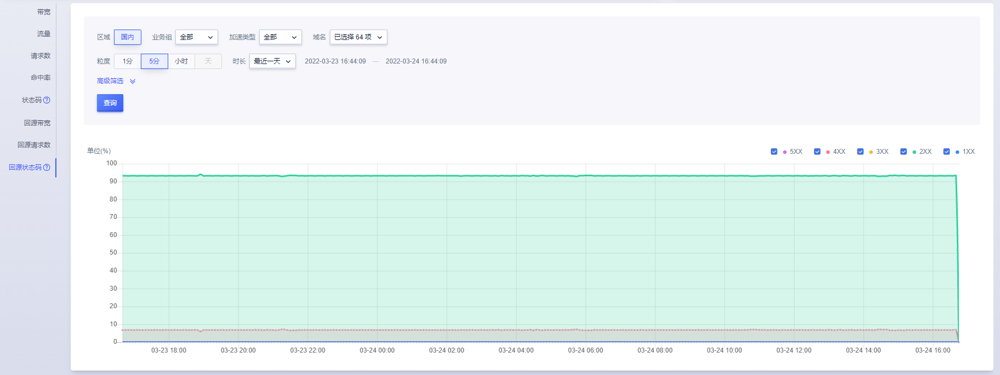

# 状态码监控

状态码监控是CDN服务的一个重要监控项，通过状态码监控，您可以了解CDN的服务情况。

状态码监控主要分为两部分组成：筛选条件和数据详情。

#### 筛选条件包含：

* 业务组：默认为全部

* 加速类型：页面、下载、点播 ；默认为全部

* 域名：可选择多个域名、单个域名、全部域名；默认为全部域名

* 粒度：5分钟、小时、天；

* 时长：最近一天，最近一周，最近一月，自定义时间范围。

>注：
>
>* 如查看3月4日一天的数据情况，时间设定为：3-4 00:00:00~ 3-5 00:00:00
>
>* 查询时间范围大于30天，暂不支持查看“5分钟”粒度的监控数据
>* 查询时间范围小于等于1天，暂不支持查看”天“粒度的监控数据
>* 对于全站加速业务，当区域选择为“境内”或“境外”时，均不支持使用“高级筛选”功能（即无法按省份、运营商查看命中率和状态码）。

