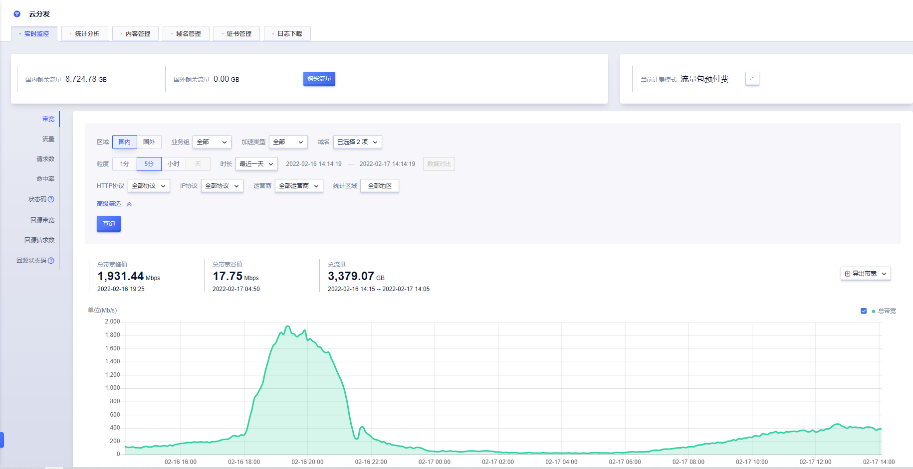

# 带宽监控

带宽监控是CDN服务的一个重要监控项，通过带宽监控，您可以了解在CDN侧产生的业务带宽，有助于进一步分析业务情况。

带宽监控主要分为两部分组成：<strong>筛选条件</strong>和<strong>数据详情</strong>。

#### 筛选条件包含：

* 区域：境内和境外

* 业务组：默认为全部

* 加速类型：页面、下载、点播 ；默认为全部

* 域名：可选择多个域名、单个域名、全部域名；默认为全部域名

* 粒度：1分钟、5分钟、小时、天；

* 时长：最近一天(默认)，最近一周，最近一月，自定义时间范围。系统默认展示最近一天的监控情况，也可根据需求选择查询的时间粒度，最长支持查询31天的数据；若使用高级筛选，可根据分运营商或者分地区进行查看，最长支持查询31天的数据。

>注：
>
>* 如查看3月4日一天的数据情况，时间设定为：3-4 00:00:00~ 3-5 00:00:00
>
>* 查询时间范围大于3天，暂不支持查看“1分钟”粒度的监控数据
>* 查询时间范围小于等于1天，暂不支持查看"天"粒度的监控数据
>* 查询时间范围大于30天，暂不支持查看“5分钟”、“1分钟”粒度的监控数据

#### 高级筛选包含：

* HTTP协议：HTTP、HTTPS；默认为全部协议
* 运营商：中国联通、中国移动、中国电信、教育网、广电等；默认为全部运营商
* 统计区域：包含大陆各个省份，最多可选择5个省份；默认为全部省份 

>注：
>
>当查询<code>粒度</code>为“1分钟”时，暂不支持设置高级筛选条件
>
>当指定<code>HTTP协议</code>时，暂不支持设置省份运营商

#### 数据详情包含：

* 总带宽峰值及峰值时刻：查询时间范围内总带宽峰值及峰值对应时间

* 总带宽谷值及谷值时刻：查询时间范围内总带宽谷值及谷值对应时间

* 95th带宽及带宽时刻：当您的计费方式为按月95计费时，可以看到95th带宽，如需查询3月份的带宽值，可指定时间范围为：<strong>3-1 00:00:00 ~  4-1 00:00:00</strong>。

* 总流量：按天维度流量数据，如查看3月4日一天的数据情况，时间设定为：<strong>3-4 00:00:00~ 3-5 00:00:00</strong>。

* 省份运营商带宽：可根据筛选条件，

* 导出带宽数据：根据筛选条件，导出带宽数据，格式为Excel。

