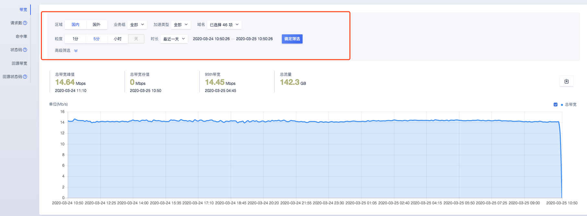
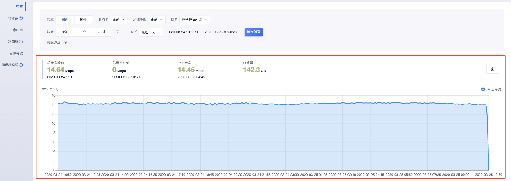

# 带宽监控

带宽监控主要分为两部分组成：筛选条件和数据详情。

#### 筛选条件包含：

* 区域：国内和国外

* 业务组：默认为全部

* 加速类型：页面、下载、点播 ；默认为全部

* 域名：可选择多个域名、单个域名、全部域名；默认为全部域名

* 粒度：1分钟、5分钟、小时、天；

* 时长：最近一天，最近一周，最近一月，自定义时间范围。

>注：
>
>* 如查看3月4日一天的数据情况，时间设定为：3-4 00:00:00~ 3-5 00:00:00
>
>* 查询时间范围大于3天，暂不支持查看“一分钟”粒度的监控数据
>* 查询时间范围小于等于1天，暂不支持查看”天“粒度的监控数据

#### 高级筛选包含：

* HTTP协议：HTTP、HTTPS；默认为全部协议
* 运营商：中国联通、中国移动、中国电信、教育网、广电等；默认为全部运营商
* 统计区域：包含大陆各个省份，最多可选择5个省份；默认为全部省份 

>注：
>
>当查询粒度为”1分钟“时，暂不支持设置高级筛选条件
>
>当指定HTTP协议时，暂不支持设置省份运营商

#### 数据详情包含：

* 总带宽峰值及峰值时刻：查询时间范围内总带宽峰值及峰值对应时间

* 总带宽谷值及谷值时刻：查询时间范围内总带宽谷值及谷值对应时间

* 95th带宽及带宽时刻：当您的计费方式为按月95计费时，可以看到95th带宽，如需查询3月份的带宽值，可指定时间范围为：3-1 00:00:00 ~  4-1 00:00:00。

* 总流量：按天维度流量数据，如查看3月4日一天的数据情况，时间设定为：3-4 00:00:00~ 3-5 00:00:00。

* 带宽详情数据：根据筛选粒度，来进行绘图。

* 导出带宽数据：根据筛选条件，导出带宽数据，格式为Excel。

