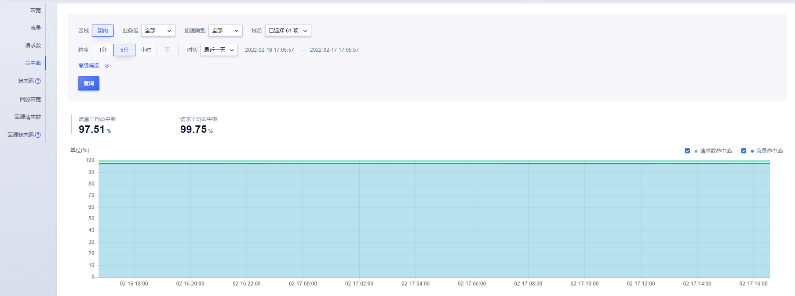

# 命中率监控

命中率监控是CDN服务的一个重要监控项，通过命中率监控，您可以了解CDN节点的缓存情况，命中率越高，说明CDN节点均命中了用户的请求，会大大提升用户体验。

请求数监控主要分为两部分组成：筛选条件和数据详情。

#### 筛选条件包含：

* 业务组：默认为全部

* 加速类型：页面、下载、点播 ；默认为全部

* 域名：可选择多个域名、单个域名、全部域名；默认为全部域名

* 粒度：5分钟、小时、天；

* 时长：最近一天，最近一周，最近一月，自定义时间范围。系统默认展示最近一天的监控情况，也可根据需求选择查询的时间粒度，最长支持查询31天的数据；若使用高级筛选，可根据分运营商或者分地区进行查看，最长支持查询31天的数据。

>注：
>
>* 如查看3月4日一天的数据情况，时间设定为：3-4 00:00:00~ 3-5 00:00:00
>
>* 查询时间范围大于30天，暂不支持查看“5分钟”、“1分钟”粒度的监控数据
>* 查询时间范围小于等于1天，暂不支持查看”天“粒度的监控数据

#### 数据详情包含：

* 流量平均命中率：指终端用户访问UCDN节点时，UCDN节点已缓存了要被访问的数据的流量占UCDN响应全部请求流量的比例。

* 请求平均命中率：指终端用户访问UCDN节点时，UCDN节点已缓存了要被访问的数据的次数占全部访问次数的比例。

  

