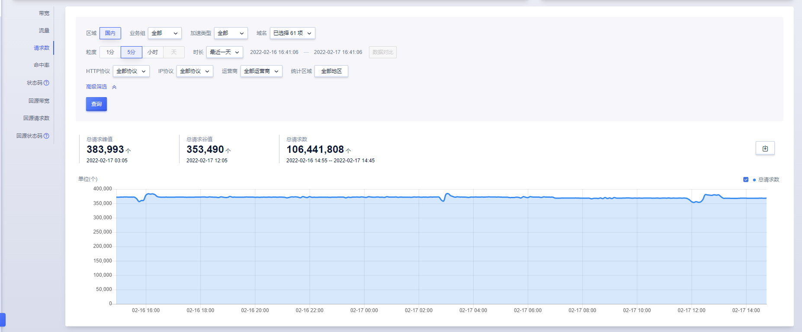

# 请求数监控

请求数监控是CDN服务一个重要的监控项，通过请求数监控，可以查看某一时间业务的请求量，来分析业务高峰，低锋的情况。

请求数监控主要分为两部分组成：筛选条件和数据详情。

#### 筛选条件包含：

* 区域：国内

* 业务组：默认为全部

* 加速类型：页面、下载、点播 ；默认为全部

* 域名：可选择多个域名、单个域名、全部域名；默认为全部域名

* 粒度：1分钟、5分钟、小时、天；

* 时长：最近一天，最近一周，最近一月，自定义时间范围。系统默认展示最近一天的监控情况，也可根据需求选择查询的时间粒度，最长支持查询32天的数据；若使用高级筛选，可根据分运营商或者分地区进行查看，最长支持查询30天的数据。

>注：
>
>* 如查看3月4日一天的数据情况，时间设定为：3-4 00:00:00~ 3-5 00:00:00
>
>* 查询时间范围大于3天，暂不支持查看“1分钟”粒度的监控数据
>* 查询时间范围小于等于1天，暂不支持查看”天“粒度的监控数据
>* 查询时间范围大于30天，暂不支持查看“5分钟”、“1分钟”粒度的监控数据

#### 高级筛选包含：

* HTTP协议：HTTPS；默认为全部协议
* 运营商：中国联通、中国移动、中国电信、教育网、广电等；默认为全部运营商
* 统计区域：包含大陆各个省份，最多可选择5个省份；默认为全部省份 

>注：
>
>当查询粒度为”1分钟“时，暂不支持查看HTTP协议相关数据，可查看省份运营商数据
>
>当指定HTTP协议时，暂不支持设置省份运营商

#### 数据详情包含：

* 总请求数：是指访问CDN的请求数。
* 总请求数峰值：查询时间范围内总请求数峰值及峰值对应时间
* 总请求数谷值：查询时间范围内总请求数谷值及谷值对应时间

* 回源请求数：CDN回源的请求数汇总。
* 省份运营请求数：当您查询省份运营商请求数时，暂无法看到回源请求数。

* 导出带宽数据：根据筛选条件，导出带宽数据，格式为Excel。

