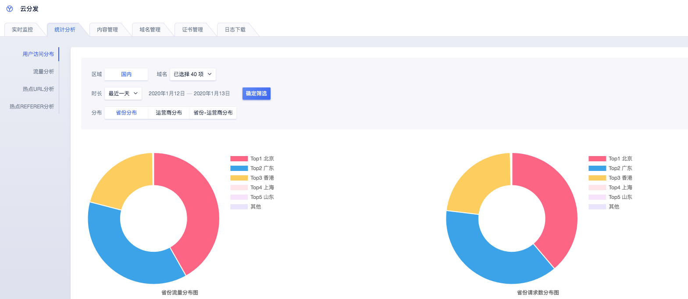
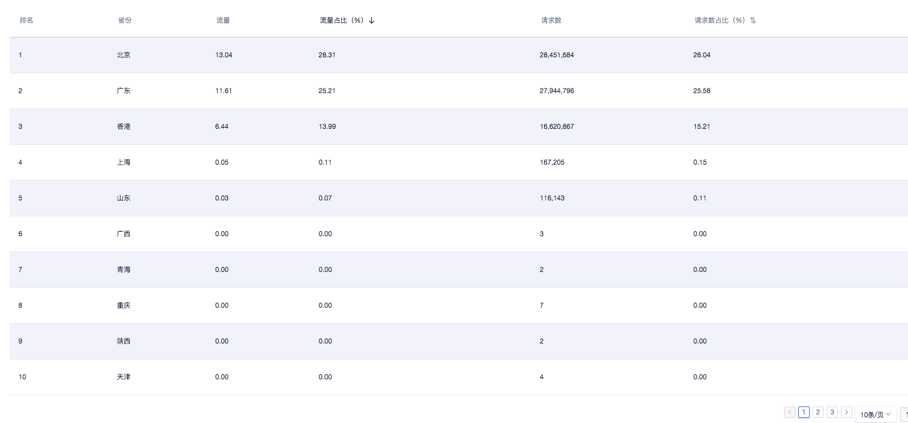

# 统计分析

统计分析共分为4个模块：用户访问分布、流量分析、热点URL分析、热点Refer分析。

注：

1. 统计分析功能暂只支持国内加速域名
2. 分析结果由CDN日志分析得来，按天粒度分析，可查看近6个月统计分析数据
3. [统计分析]功能由后端权限位控制，若有需要请联系技术支持申请开通。

### 一、用户访问分布

该模块下，您可以筛选的日期、域名信息，分布条件（分布条件包含：省份分布、运营商分布、省份-运营商分布），查看对应的访问分布列表和分布饼状图(流量、请求数两个纬度)

#### 操作步骤

您可以指定域名、日期进行筛查，展示对应的访问分布列表和分布饼状图(流量、请求数两个纬度)

### 二、流量分析

在该模块下，您可以查看到回源流量和命中流量，能帮助您进一步的看到CDN加速命中情况。

#### 操作步骤

您可以指定域名、日期进行筛查，将会展示该时段内的流量信息列表，同时以汇总的数据绘制出命中流量和回源流量的比例饼状图。

>统计分析统计按天为粒度的数据，更精细的数据可前往实时监控查看。

### 三、热点URL分析

在该模块下，您可以查看加速域名的热门URL ，分别按照请求数和流量进行排序。

#### 操作步骤

您可以指定域名、日期进行筛查，将会展示当天的该域名的请求数Top100和流量Top100的URL列表。同时也可以导出列表进行分析。

### 四、热点Referer分析

在该模块下，您可以根据筛选的域名、日志，查看对应的TOP100的Refer列表。

