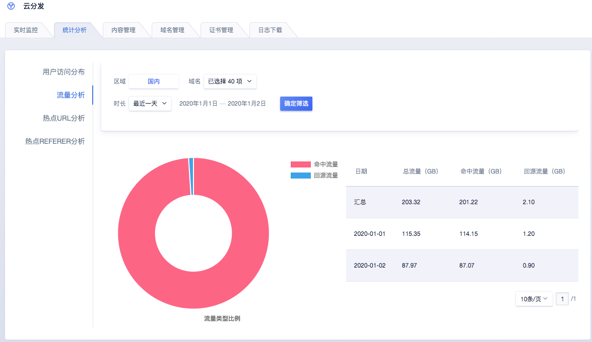
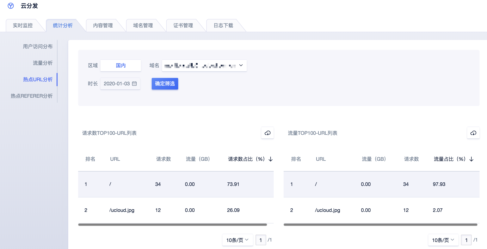
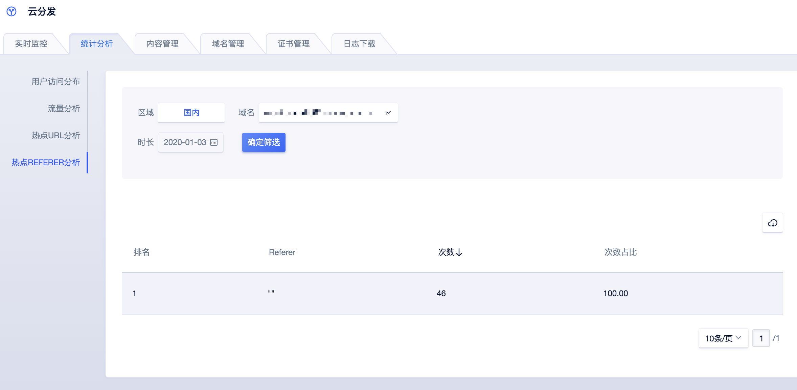

# 统计分析

## 流量分析

在该模块下，您可以查看到回源流量和命中流量，能帮助您进一步的看到CDN加速命中情况。

#### 操作步骤

您可以指定域名、日期进行筛查，将会展示该时段内的流量信息列表，同时以汇总的数据绘制出命中流量和回源流量的比例饼状图。

>统计分析统计按天为粒度的数据，更精细的数据可前往实时监控查看。

## 热点URL分析

在该模块下，您可以查看加速域名的热门URL ，分别按照请求数和流量进行排序。

#### 操作步骤

您可以指定域名、日期进行筛查，将会展示当天的该域名的请求数Top100和流量Top100的URL列表。同时也可以导出列表进行分析。

### 热点Referer分析

